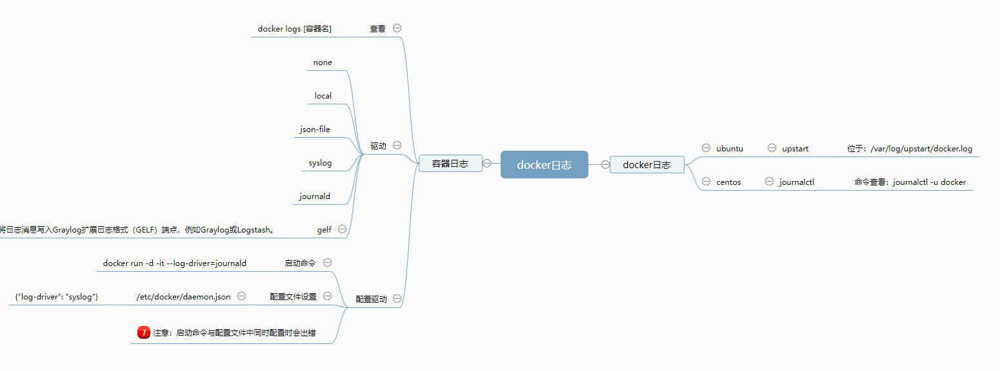

docker 日志包括引擎本身的日志以及每个容器的日志，擎本身的日志的日志已由



```
vim /etc/sysconfig/docker
```


在docker-compose中配置日志:

```
version: '2.2'

networks:
    pms:

services:
    pms_api:
        container_name: pms_api
        image: centos:latest
        logging:
                driver: json-file
                options:
                        max-size: 1g
        volumes:
         - /home/www/pms/api:/var/api
        environment:
         - SET_CONTAINER_TIMEZONE=true
         - CONTAINER_TIMEZONE=Asia/Shanghai
        environment:
         - TZ=Asia/Shanghai
        working_dir: /var/api
        command: ./ocot web
        ports:
         - 9083:9080
        networks:
         - pms

```


引用

https://www.cnblogs.com/operationhome/p/10907591.html

https://www.cnblogs.com/cocowool/p/docker_daemon_log_driver.html