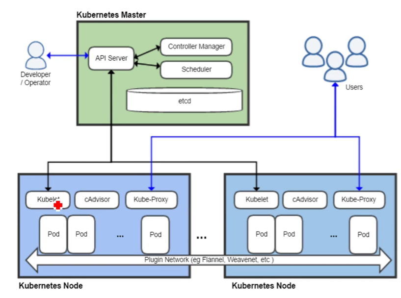

### 核心功能

* 处我修复（高可用）

* 服务发现和负载均衡

* 自动部署和回滚

* 弹性伸缩

### 应用场景

* 微服务架构

### 核心组件

| 组件               | 说明                                                         |
| ------------------ | ------------------------------------------------------------ |
| etcd               | 保存了整个集群的状态                                         |
| apiserver          | 提供资源操作的唯一入口，并提供认证、授权、访问控制、API注册及发现等机制 |
| controller manager | 负责维护集群的状态，如故障检测、自动扩展、滚动更新等         |
| scheduler          | 负责资源高度，控制预定的策略将pod调度到相应的机器上          |
| kubelet            | 负责维护容器的生命周期，同时也负责 volume和网络管理          |
| container runtime  | 负责镜像管理以及pod和容器的真正运行                          |
| kub-proxy          | 负责为service提供cluster内部的服务发现和负载均衡             |

### 扩展组件

| 组件                  | 说明                         |
| --------------------- | ---------------------------- |
| kube-dns              | 负责为整个集群提供DNS服务    |
| ingress controller    | 为服务提供外网入口           |
| heapster              | 提供资源监控                 |
| dashboard             | 提供GUI                      |
| federation            | 提供跨可用区的集群           |
| fluentd-elasticsearch | 提供集群日志采集、存储、查询 |


### 架构图



### 节点安装

master节点

* etcd

  ```
  [root@localhost ~]#  yum install -y etcd
  [root@localhost ~]#  vim /etc/etcd/etcd.conf
  [root@localhost ~]#  systemctr start etcd
  ```

  

* api-server

* controler manager

* schedule

  ```
  [root@localhost ~]# yum install -y kubernetes-master.x86_64
  [root@localhost ~]# vim /etc/kubernetes/apiserve
  # 监听地址
  KUBE_API_ADDRESS="--insecure-bind-address=0.0.0.0"
  # 监听端口
  KUBE_API_PORT="--port=8080"
  # 运行的kubelet的node节点端口，apiserve将以端口向node发起通信，因此node节点应该设置端口为此端口
  KUBELET_PORT="--kubelet-port=10250"
  # etcd接口地址
  KUBE_ETCD_SERVERS="--etcd-servers=http://192.168.50.5:2379"
  
  [root@localhost ~]# vim /etc/kubernetes/config
  # How the controller-manager, scheduler, and proxy find the apiserver
  KUBE_MASTER="--master=http://192.168.50.5:8080"
  
  # 启动服务
  [root@localhost ~]# systemctl start kube-apiserver.service
  [root@localhost ~]# systemctl start kube-controller-manager.service
  [root@localhost ~]# systemctl start kube-scheduler.service
  
  # 添加开机启动
  [root@localhost ~]# systemctl enable kube-apiserver.service
  [root@localhost ~]# systemctl enable kube-controller-manager.service
  [root@localhost ~]# systemctl enable kube-scheduler.service
  
  # 检查启动状态
  [root@localhost ~]# kubectl get cs
  ```

  启动如果出现错误，通过以下命令进行错误日志分析

  ```
  cat /var/log/messages|grep kube-apiserver|grep -i error
  ```

  

node节点

* kubelet
* kube-proxy
* docker

```
# 安装
[root@localhost ~]# yum install -y kubernetes-node.x86_64

# 修改配置
[root@localhost ~]# vim /etc/kubernetes/kubelet
# The address for the info server to serve on (set to 0.0.0.0 or "" for all interfaces)
KUBELET_ADDRESS="--address=192.168.50.5"

# The port for the info server to serve on
KUBELET_PORT="--port=10250"

# You may leave this blank to use the actual hostname
KUBELET_HOSTNAME="--hostname-override=k8s-master"

# location of the api-server
KUBELET_API_SERVER="--api-servers=http://192.168.50.5:8080"

# pod infrastructure container
KUBELET_POD_INFRA_CONTAINER="--pod-infra-container-image=registry.access.redhat.com/rhel7/pod-infrastructure:latest"

# Add your own!
KUBELET_ARGS=""

# 启动服务
[root@localhost ~]# systemctl start kubelet.service

# 添加开机启动
[root@localhost ~]# systemctl enable kubelet.service
```


### 管理

kubectl 用于管理，常用的功能如下：

```
# 获取节点
kubectl get nodes
# 运行状态
kubectl get cs
# 删除节点
kubectl delete node nodename
```

