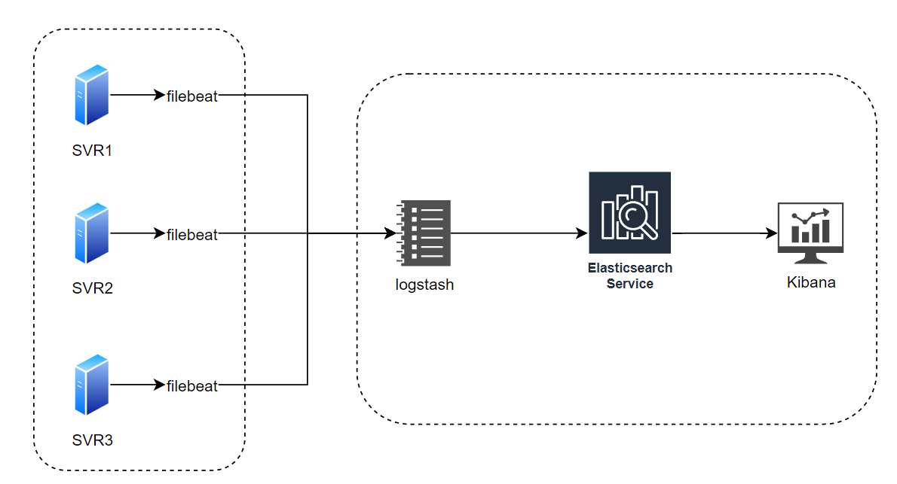

### filebeat

Filebeat是用于转发和集中日志数据的轻量级传送工具。Filebeat监视您指定的日志文件或位置，收集日志事件，并将它们转发到Elasticsearch或 Logstash进行索引。
安装在产生日志的机器上


### logstash
Logstash是一个接收，处理，转发日志的工具。支持系统日志，webserver日志，错误日志，应用日志，redis日志，nginx日志等。对数据进行过虑，再写入Elasticsearch中。

- 接收日志
- 分析过滤日志
- 输出日志

其配置文件的框架也主要包含三部分:
```
input{}, 
filter{},
output{}
```
input 输入插件可以是file , stdin , filebeat , redis , ftp等。
filter 过滤插件可以是grok , date , mutate，kv等。

​	-	[grok 插件预设语法](https://github.com/elastic/logstash/blob/v1.4.2/patterns/grok-patterns)

output 输出插件可以是标准输出stdout , file ,Elasticsearch , redis , ftp 等。


配置文件解读：

[Logstash 最佳实践](http://doc.yonyoucloud.com/doc/logstash-best-practice-cn/index.html)


### elasticsearch

  对数据创建索引
### kibana
Kibana主要功能:全文本搜索，字段搜索，组合查询，按字段统计，图表展示，保存，以及实时动态展示数据。