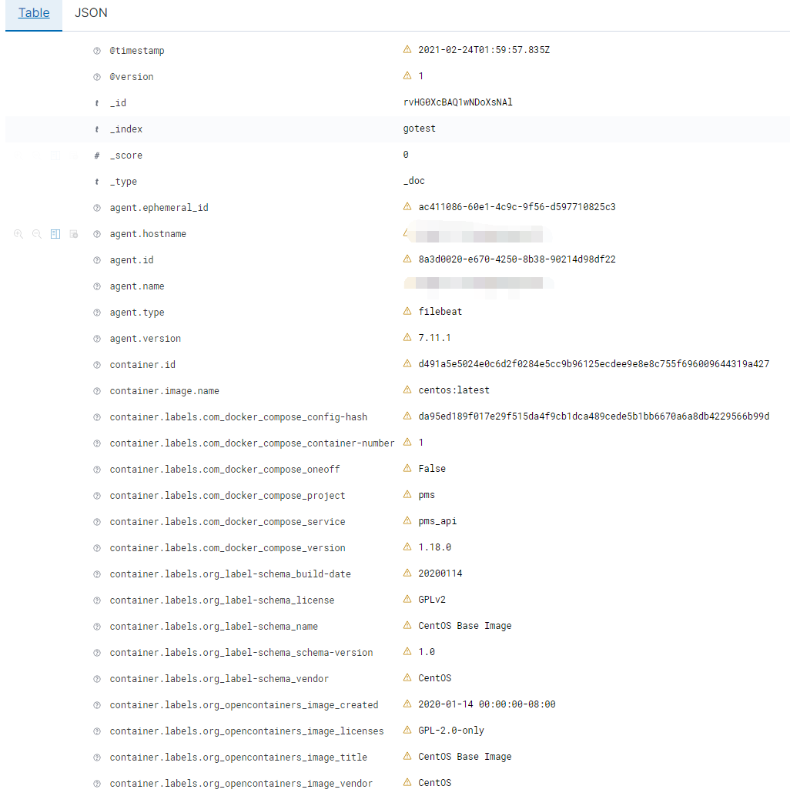

```
input{}, 
filter{},
output{}
```

## 输入

```
input{}
```


## 过滤器

- grok
- date
- mutate
- geoip
- json
- split
- useragent
- key-value
- ruby
- metrics


**grok**

Grok 是 Logstash 最重要的插件。你可以在 grok 里预定义好命名正则表达式，在稍后(grok参数或者其他正则表达式里)引用它。 

```
filter{
	grok {
		match => {
		// 127.0.0.1 - - [20/Oct/2020:23:45:57 +0800] "GET /EC/07/1B163A66812A5E98B1E117E8AD4AFA5EEAFB HTTP/1.1" 404 286
		"message" => "%{IPV4:ip} .* \[%{DATA:timestamp}\] \"%{WORD:method} %{URIPATHPARAM:request_uri} .*\/%{DATA:http_version}\" %{NUMBER:status_code} %{NUMBER:lenght}"
		}
	}
}
# 自定义正则，格式：(?<custom_feild>(.*)) 其中`<custom_feild>` 为字段，`(.*)`为字段对应的正则
.*\[(?<custom_feild>(.*))\].*
```

grok中如果有多咱日志类型，可以为match设置多个匹配，传递参数时需要传递一个包含偶数个数的数组，如下:

```
    grok {
        match => [
            "message","%{IPV4:ip} - \[%{DATA:timestamp}\] \"%{WORD:method} %{URIPATHPARAM:request_uri} HTTP\/%{DATA:http_version} %{NUMBER:status_code} %{NOTSPACE:duration} %{NUMBER:lenght}\" \"%{GREEDYDATA:agent}\" \"%{GREEDYDATA:error}\"",
            "message","\[%{DATA:timestmp}\] %{DATA:source} \[%{NOTSPACE:drution}\] \[%{BASE10NUM:rows}\] %{GREEDYDATA:sql}"
        ]
    }
```


[grom格式在线测试](https://www.5axxw.com/tools/v2/grok.html)

**date**

*date* 插件可以用来转换你的日志记录中的时间字符串，变成 `LogStash::Timestamp` 对象，然后转存到 `@timestamp` 字段里。**outputs/elasticsearch 中常用的 `%{+YYYY.MM.dd}` 这种写法必须读取 `@timestamp` 数据，所以一定不要直接删掉这个字段保留自己的字段，而是应该用 filters/date 转换后删除自己的字段！**

```
date {
	 match => ["timestamp", "dd/MMM/yyyy:HH:mm:ss Z"]
	 remove_field => [stimestamp] # 删除原字段
}
```


## 输出

```
output{
    elasticsearch{
        hosts => "http://localhost:9200"
        index => "logstash-apache"
    }
    stdout{}
}
```


## 启动

```
.\logstash -e "input{stdin{}} output{stdout{}}"
.\logstash -f ..\config\test.yml -t // 测试配置文件是否正确
```


### 扩展

* 监听多个filebeat输入

  filebeat.yml 

  ```
  
  filebeat.inputs:
  - type: log
    enabled: true
    backoff: "1s"
    tail_files: false
    paths:
      - /usr/local/nginx/logs/access-json.log
    fields:
      filetype: log_nginxjson
    fields_under_root: true
  - type: log
    enabled: true
    backoff: "1s"
    tail_files: false
    paths:
      - /var/log/messages
    fields:
      filetype: log_system
    fields_under_root: true
  output.logstash:
    enabled: true
  
  ```

  logstash.yml

  ```
  
  input {
     #从filebeat取数据，端口与filebeat配置文件一致
     beats {
       host => "0.0.0.0"
       port => 5044
     }
  }
  filter {
      #只对nginx的json日志做json解析，系统message为其他格式，无需处理
      if [filetype] == "log_nginxjson"{
        json {
           source => "message"
           remove_field => ["beat","offset","tags","prospector"] #移除字段，不需要采集
        }
        date {
          match => ["timestamp", "dd/MMM/yyyy:HH:mm:ss Z"] #匹配timestamp字段
          target => "@timestamp"  #将匹配到的数据写到@timestamp字段中
        }
    }
  }
   
  output {
         # 输出es，这的filetype就是在filebeat那边新增的自定义字段名
         if [filetype] == "log_nginxjson" {
           elasticsearch {
              hosts => ["wykd:9200"]
              index => "nginx-%{+YYYY.MM.dd}"
          }
         } else if [filetype] == "log_system" {
           elasticsearch {
              hosts => ["wykd:9200"]
              index => "msg-%{+YYYY.MM.dd}"
          }
         }
   
  
  ```

* 数据是否会重推

  https://elasticsearch.cn/question/4622
  
* 自定义输出模板

    ```
    output {
        elasticsearch {
            host => "127.0.0.1"
            manage_template => false
            template => "/etc/logstash/conf.d/single-line.tpl"
            template_name => "single-line"
        }
    }
    ```

    模板内容:

    ```
    {  
        "template": "single-line",  
        "settings": {  
            "index.number_of_shards": 3,  
            "number_of_replicas": 0   
        },  
        "mappings" : {  
          "logs" : {  
            "properties" : {  
              "@timestamp" : {
                "type" : "date",  
                "format" : "dateOptionalTime",  
                "doc_values" : true  
              },  
              "@version" : {  
                "type" : "string",  
                "index" : "not_analyzed",  
                "doc_values" : true      
              },  
              "id" : {  
                "type" : "string",  
                "index" : "not_analyzed"  
              },  
              "message" : {  
                "type" : "string",  
                "index" : "not_analyzed"  
              }
            }  
          }  
        }  
      }  
    }
    ```

    

* 优化推送字段

    除了源输入内容外，logstash会收集客户端的agent\contianner\host等信息，并附加到_source中，推送给elasticsearch，如果不想收集这些信息，可以通过mudate进行字段删除

    ```
    filter{
    	mutate{
    		remove_field => ["agent"]
    		remove_field => ["host"]
    		...
    	}
    }
    
    ```

    

    

    

http://doc.yonyoucloud.com/doc/logstash-best-practice-cn/index.html