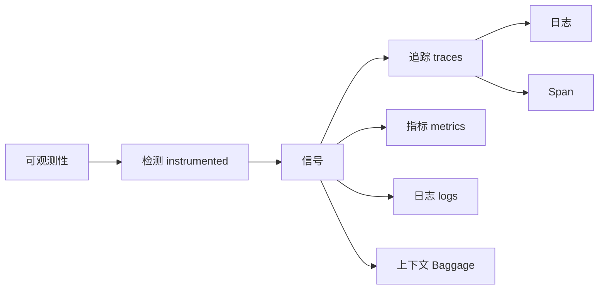
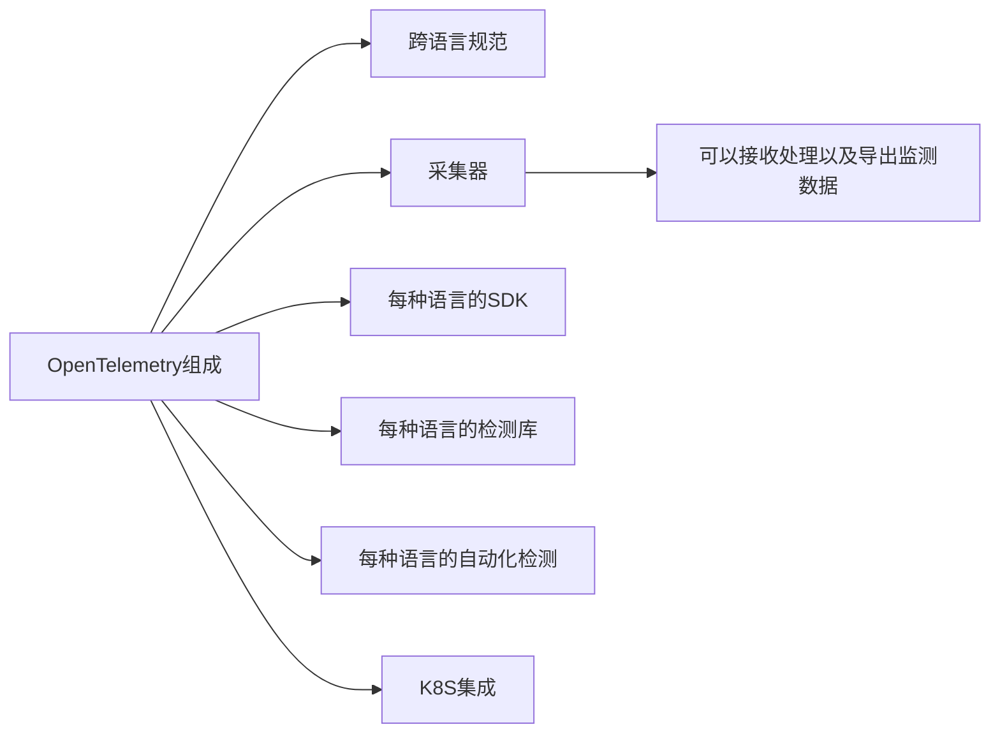
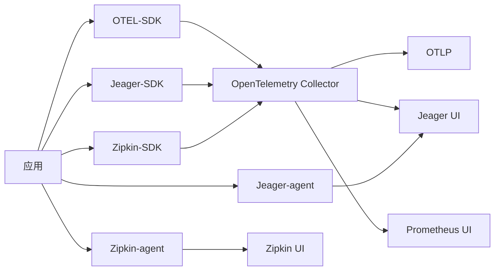

围绕着平台的可观测性，催生了一系列开源用于观测的平台，如 ([Jaeger](https://www.jaegertracing.io/) 和 [Zipkin](https://zipkin.io/)),可每个平台对于数据的采集规则并不一样。于是为了统一业界标准，Opentelemtry(OTel)诞生了。
需要强调的是OpenTelemetry 不是像 Jaeger 或 Prometheus 那样提供可观察性的后端。相反，它支持将数据导出到各种开源和商业后端。它提供了一个可插入的架构，因此可以轻松添加额外的技术协议和格式。



#### 采集器
![[Pasted image 20221228173158.png]]



```
                                          -----> Jaeger (trace)
App + SDK ---> OpenTelemetry Collector ---|
                                          -----> Prometheus (metrics)
```