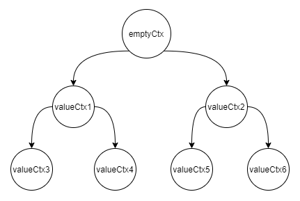

## context 包详解

`context `包中我们需要用的几个重点函数有：

```go
func Background() Context

func WithCancel(parent Context) (ctx Context, cancel CancelFunc)
func WithDeadline(parent Context, d time.Time) (Context, CancelFunc)
func WithTimeout(parent Context, timeout time.Duration) (Context, CancelFunc)
func WithValue(parent Context, key, val interface{}) Context
```

我们实际产生作用的是`With***`系列的方法，其中`WithTimeout`与`WithDeadline`是对`WithCance`l的再次封装，因此我们如果需要搞清楚`context`包的作用，那么只要理解`WithCancel`与`WithValue`即可。

### WithCancel

我们以一个简单的游戏开始,游戏规则：10个人抽奖，每人随机抽10次，**只要有人抽到一等奖就通知其他人退出**。

```go
ctx, cancel := context.WithCancel(context.Background())

wg := sync.WaitGroup{}

log.Println("开始抽奖了...")
rand.Seed(time.Now().UnixNano())
for c := 0; c < 10; c++ {
	wg.Add(1)
	go func(ctx context.Context, cancel context.CancelFunc, c int) {
		for i := 0; i < 10; i++ {
			if rand.Intn(10) == 1 {
				log.Printf("成员%d:经过%d次尝试，抽到1等奖\n", c, i)
				cancel()
				break
			}
			select {
			case <-ctx.Done():
				// 收到其它通知不干了
				log.Printf("成员%d:有人抽到了，我不抽了\n", c)
				wg.Done()
				return
			default:
				time.Sleep(1 * time.Second)
			}
		}
		wg.Done()
	}(ctx, cancel, c)
}

wg.Wait()
```

>  当然你可能会发现有些问题，因为程序是并发的，因此可能会有多个人抽到一等奖，但这对本次测试并没有什么影响。
>
>  运行程序可以看到当有人抽到一等奖时，会调用 `cancel()`方法，该方法是`context.WithCancel`的返回值，而让协程退出的是对`<-ctx.Done()`监听，大体我们可以猜测，`cancel()`一定是向`<-ctx.Done()` channel 发送信息，又或者是`cancel()`关闭了`channel`,只有这两种情况`<-ctx.Done()`对应的阻塞会结束。

来看看`WithCancel`的源代码:

C:\Go\src\context\context.go line:233

```go
func WithCancel(parent Context) (ctx Context, cancel CancelFunc) {
	if parent == nil {
		panic("cannot create context from nil parent")
	}
	// 创建一个 cancelCtx
	c := newCancelCtx(parent)
	// 当parent为emptyCtx时，这里什么也没做
	propagateCancel(parent, &c)
	return &c, func() { c.cancel(true, Canceled) }
}
...
type cancelCtx struct {
	Context

	mu       sync.Mutex            // protects following fields
	done     chan struct{}         // created lazily, closed by first cancel call
	children map[canceler]struct{} // set to nil by the first cancel call
	err      error                 // set to non-nil by the first cancel call
}
...
func (c *cancelCtx) Done() <-chan struct{} {
	c.mu.Lock()
	if c.done == nil {
		c.done = make(chan struct{})
	}
	d := c.done
	c.mu.Unlock()
	return d
}
...
func (c *cancelCtx) cancel(removeFromParent bool, err error) {
	if err == nil {
		panic("context: internal error: missing cancel error")
	}
	c.mu.Lock()
	if c.err != nil {
		c.mu.Unlock()
		return // already canceled
	}
	c.err = err
	if c.done == nil {
		// 如果不存在，则进行初始化：var closedchan = make(chan struct{})
		// 注意context.go文件中的init()函数，对closedchan做了关闭处理。
		// func init() {
		// 	 close(closedchan)
		// }
		c.done = closedchan
	} else {
		close(c.done)
	}
	for child := range c.children {
		// NOTE: acquiring the child's lock while holding parent's lock.
		child.cancel(false, err)
	}
	c.children = nil
	c.mu.Unlock()

	if removeFromParent {
		removeChild(c.Context, c)
	}
}
```

>`WithCancel`返回`cancelCtx`实例与一个`CancelFunc`函数。`CancelFunc`就是前面所调用的`cancel`。在`cancelCtx`中我们可以看到存在一个`channel`,该`channel`就是负责与`<-ctx.Done()`进行通信的。
>
>```
>done     chan struct{}
>```
>
>通过`cancel`我们可以得知，只要执行了该函数，`cancelCtx`的chanecl状态一定是处于`closed`状态，而只要是`channel`处于关闭状态，对`channel`的读取阻塞就会结束，`select...case <-ctx.Done()` 中则会捕获，进行终止程序。
>
>另一方面，我们通过代码：
>
>```go
>	for child := range c.children {
>		// NOTE: acquiring the child's lock while holding parent's lock.
>		child.cancel(false, err)
>	}
>	c.children = nil
>```
>
>可以看出，程序会迭代清理子`cancelCtx`

### WithValue

来看看`WithValue`的源代码:

C:\Go\src\context\context.go line:521

```go
func WithValue(parent Context, key, val interface{}) Context {
	if parent == nil {
		panic("cannot create context from nil parent")
	}
	if key == nil {
		panic("nil key")
	}
	if !reflectlite.TypeOf(key).Comparable() {
		panic("key is not comparable")
	}
	return &valueCtx{parent, key, val}
}

type valueCtx struct {
	Context
	key, val interface{}
}
```

> 函数非常简单，输入一个Context类型，返回一个组合Context接口的valueCtx实例。传入的键值对也会存储在其中。由于键值对为interface类型，因此我们可以自由发挥，存放想要的数据。
>
> 示例代码：
>
> ```go
> func Call(ctx context.Context, nodeName string) {
> 	// 子协程中查询父协和传递的信息
> 	fmt.Println(nodeName, " parent is ", ctx.Value("node"))
> 	context.WithValue(ctx, "node", nodeName)
> }
> 
> func main() {
> 	ctx := context.Background()
> 	go func(ctx context.Context) {
> 		valueCtx1 := context.WithValue(ctx, "node", "valueCtx1")
> 		go Call(valueCtx1, "valueCtx3")
> 		go Call(valueCtx1, "valueCtx4")
> 		valueCtx2 := context.WithValue(ctx, "node", "valueCtx2")
> 		go Call(valueCtx2, "valueCtx5")
> 		go Call(valueCtx2, "valueCtx6")
> 	}(ctx)
> }
> ```
>以上的代码我们将得到一个这样的结构，通过层级关系，下层可以获得上层传递过来的数据。
> 

### 总结

`context`包有两大作用：

- 按节点批量关闭协程（可以主动关闭、延时关闭、定时关闭）
- 进行上下文传导传值

