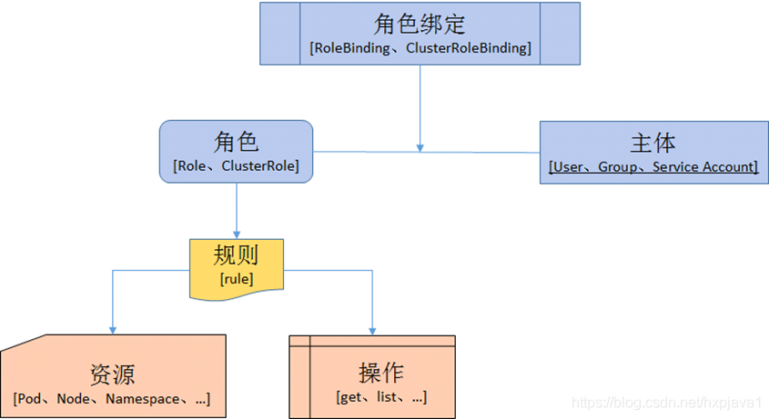

### 概述

Service Account为Pod中的进程和外部用户提供身份信息。所有的kubernetes集群中账户分为两类，Kubernetes管理的serviceaccount(服务账户)和useraccount（用户账户）。

操作人员与apiserver进行交互时,采用 User Account,而Pod中的与apiserver进行交互时,采用Service Account.

### 认证插件

- bearer token 当使用来自 http 客户端的 bearer token 时，API server 期望 `Authorization` header 中包含 `Bearer token` 的值。Bearer token 必须是一个字符串序列，只需使用 HTTP 的编码和引用功能就可以将其放入到 HTTP header 中。
- 客户端证书 客户端请求前需要，需要发送api server的办法的证书，由api server来确认是否他来签署的，引用的文件必须包含一个或多个证书颁发机构，用于验证提交给 API server 的客户端证书。如果客户端证书已提交并验证，则使用 subject 的 Common Name（CN）作为请求的用户名。反过来，api server也要验证客户端的证书，所有对于客户端也应该有一个证书，提供api server 验证，此过程是双向验证。
- HTTP BASE 认证： 通过用户名+密码方式认证。


` service account`应该在pod创建之前存在，否则`pod`会创建失败,另外不能更新已创建的 pod 的 service account。

#### service account

创建一个新的 serviceAccount，它是如何工作的呢？在 apiserver 创建 pod 的时候并不会去校验创建的 pod 的 secret 是否存在。只有在kubelet 去调用这个 pod 的时候，才会去 apiserver 获取这个 secret，没有的话会按照一定的时间间隔去访问，同时会输出一个event报告为什么没有访问通apiserver。如果存在secret，kubelet会创建一个volume，去将secret映射到pod中，之后才会去启动container。之后，pod访问apiserver时，pod会使用ca.crt去校验apiserver发过来的证书，apiserver会校验pod发过来的token。

1. 创建Service Account: 用户通过kubectl创建serviceaccount, 请求会发到controller manager，controller manager启动参数中配置的`--service-account-private-key-file` 对serviceaccount对应的用户（这里其实是虚拟用户，可能是CN或者一个随机数）进行签名生成serviceaccount对应的secret里边的token。多master的情况下，需要使用server的key，client的key在各个节点不一致。

2. Pod与Service Account的关联：用户创建 pod 时指定serviceaccount。 pod 启动时，k8s 会把对应的信息 ca.crt, namespace,token这些信息会挂载到pod的`/var/run/secrets/kubernetes.io/serviceaccount` 目录下。

   

3. Pod中的应用如何使用 Service Account: pod中的应用访问k8s api，这些pod应用使用go-client或者其他语言的客户端访问k8s api， 使用incluster方式初始化client，也就是会去`/var/run/secrets/kubernetes.io/serviceaccount`寻找token，发送到apiserver，请求访问api。

   ```
   apiVersion: v1
   kind: Pod
   metadata:
     name: my-pod
   spec:
     serviceAccountName: build-robot
   ```

4. Api Server对token进行验证:由于加密使用的是server.key，是私钥，所以apiserver启动参数--service-account-key-file需要配置成

1.查看`Pod`详情

```
kubectl decribe po/jenkins-abcd45
```

找到

```
Volumes:
  ...
  kube-api-access-tlfmz:
    Type:                    Projected (a volume that contains injected data from multiple sources)
    TokenExpirationSeconds:  3607
    ConfigMapName:           kube-root-ca.crt
    ConfigMapOptional:       <nil>
    DownwardAPI:             true
```


https://www.kancloud.cn/chriswenwu/g_k8s/1006505

如果一个`Pod` 在定义时没有指定`spec.serviceAccountName`属性，则系统会自动为其赋值为"default”，即大家都使用同一个`Namespace`下默认的`Service Account`。
如果某个`Pod`需要使用
非`default `的`Service Account`，则需要在定义时指定:

```
apiversion: v1
kind: Pod
metadata :
  name : mypod
spec:
  containers:
    - name: mycontainter
    image: nginx : v1
  serviceAccountName: myserviceaccount

```

Kubernetes之所以要创建两套独立的账号系统，原因如下。

- User账号是给人用的，Service Account是给Pod里的进程使用的，面向的对象不同。
- User账号是全局性的，Service Account则属于某个具体的Namespace。
- 通常来说，User账号是与后端的用户数据库同步的，创建一个新用户通常要走一套复杂的业务流程才能实现，Service Account 的创建则需要极轻量级的实现方式，集群管理员可以很容易为某些特定任务创建一个 Service Account。
- 对于这两种不同的账号，其审计要求通常不同。
- 对于一个复杂的系统来说，多个组件通常拥有各种账号的配置信息，`Service Account`是 `Namespace`隔离的，可以针对组件进行一对一的定义，同时具备很好的“便携性”。

#### Secret 

我们可以通过Secret保管其他系统的敏感信息（比如数据库的用户名和密码)，并以 Mount的方式将Secret 挂载到Container中，然后通过访问目录中的文件的方式获取该敏感信息。当Pod被API Server创建时，API Server不会校验该Pod引用的 Secret是否存在。一旦这个Pod被调度，则 kubelet将试着获取Secret 的值。如果 Secret不存在或暂时无法连接到API Server，则 kubelet将按一定的时间间隔定期重试获取该Secret,并发送一个 Event 来解释Pod没有启动的原因。一旦Secret被 Pod获取，则 kubelet将创建并Mount包含Secret的 Volume。只有所有Volume被 Mount后，Pod中的Container才会被启动。在kubelet启动 Pod中的Container后，Container中的和 Secret相关的Volume将不会被改变，即使Secret本身被修改了。为了使用更新后的Secret，必须删除旧的Pod，并重新创建一个新的Pod，因此更新Secret的流程和部署一个新的Image是一样的。

